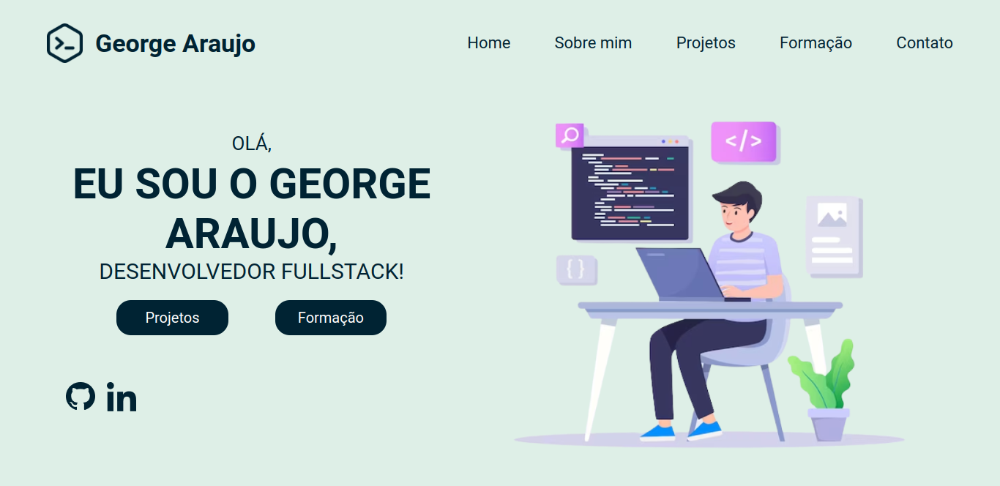
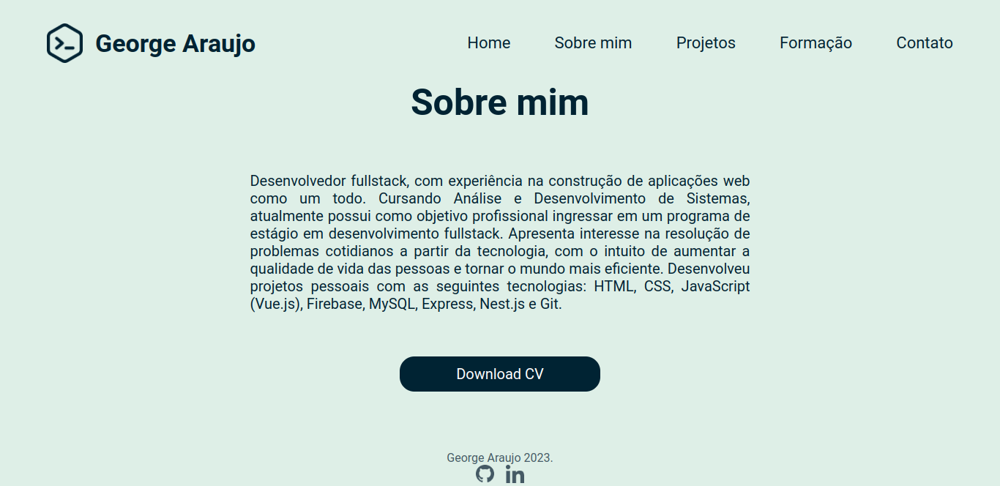
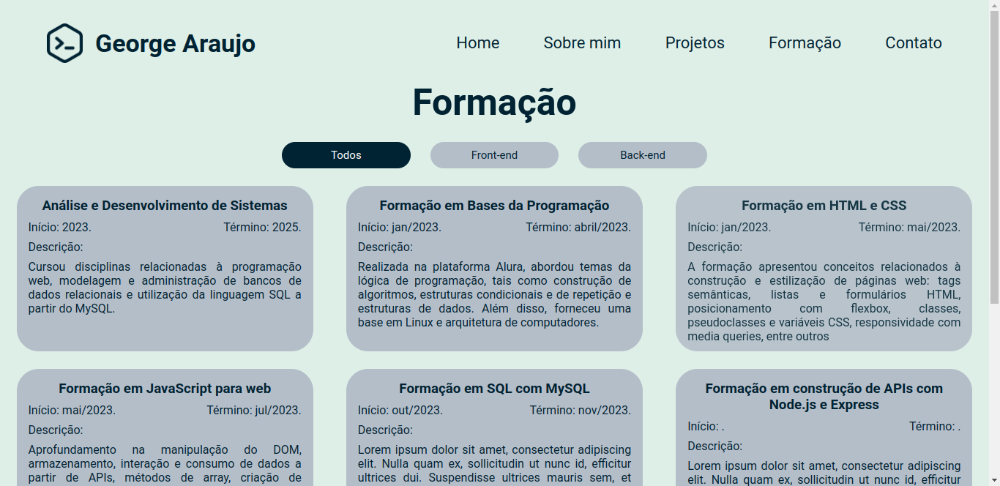
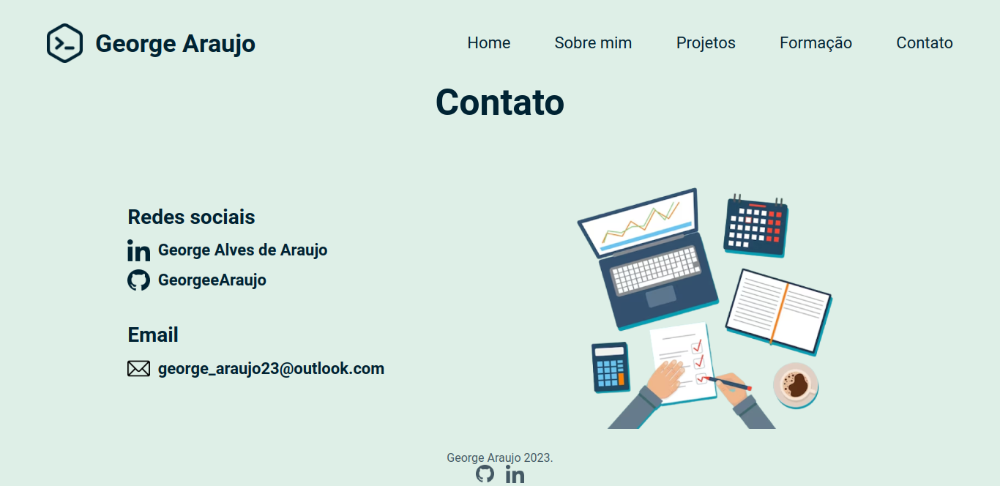
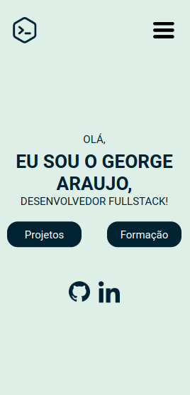
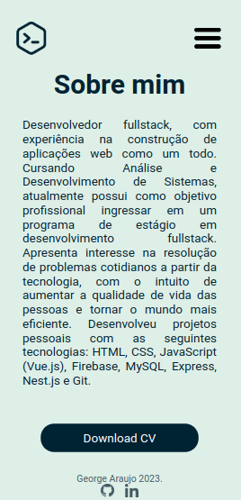
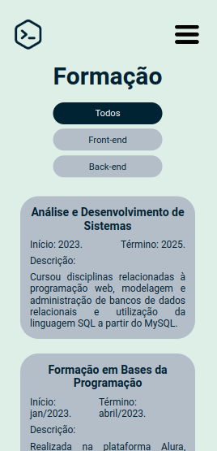
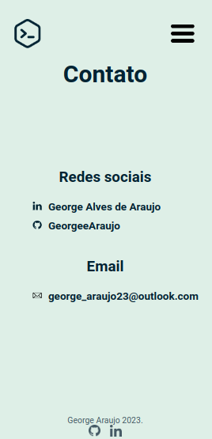

<h1 align="center">
     <a href="" alt="site do portfolio"> Website de Portfolio </a>
</h1>
<h3 align="center">
    Um website com as informações principais sobre o programador George Alves de Araujo.
</h3>

     
     
     
     
     
     

Índice
=================

## 📖 Sobre o projeto

O website foi desenvolvido com o objetivo de divulgar e demonstrar o trabalho de George Araujo como desenvolvedor fullstack. 

## ⚙️ Funcionalidades

- [x] Os usuários podem obter informações sobre:
  - [x] Objetivos e trajetória profissional.
  - [x] Formação técnica e acadêmica (cursos realizados, tecnologia utilizadas, entre outros).
  - [x] Projetos finalizados (com opções de filtro).
  - [x] Informações de contato (email e redes sociais).
       

- [x] Responsividade para dispositivos móveis (tablets e celulares).

 👀 As funcionalidades descritas podem ser testadas no site oficial do projeto. ➡️ Clique <a href="">aqui.⬅️ </a>

---

## 🛠️ Tecnologias

As seguintes tecnologias foram utilizadas no projeto:

#### **Website** 
- JavaScript (https://developer.mozilla.org/pt-BR/docs/Web/JavaScript)
     - Manipulação do DOM.
     - Métodos de array.
     - Objetos.
     - Validação de formulários.
     - Responsividade.
- HTML (https://developer.mozilla.org/pt-BR/docs/Web/HTML).
- CSS (https://developer.mozilla.org/pt-BR/docs/Web/CSS).
     - Flexbox.
     - Position.
     - Media queries.
     - Estilização de maneira geral.
     - 
#### **Utilitários**

- Visual Studio Code (https://code.visualstudio.com/).
- Git e GitHub (https://git-scm.com/).

--- 

## 🎨 Layout

### Website para desktops.
<h4>Página inicial</h4>

<h4>Página de "Sobre Mim"</h4>

<h4>Página de projetos</h4>

<h4>Página de formações técnicas e acadêmicas</h4>

<h4>Página de contato</h4>

### Website mobile.
<h4 align="center">Página inicial, Sobre Mim e de Projetos</h4>

     
     
     

<h4 align="center">Página de formações técnicas e acadêmicas e de contato</h4>

     
     

---

## 🦸 Autor

George Alves de Araujo. 🚀

 

---

## 📝 Licença

Este projeto está sob a lincença [MIT](./LICENSE).

---

